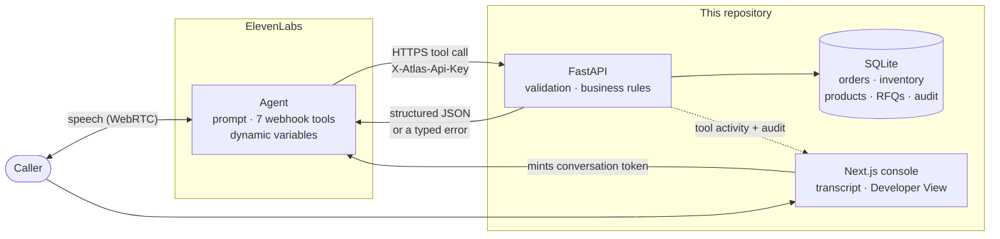

# Atlas Industrial Supply — voice agent deployment

A synthetic industrial distributor with an [ElevenLabs](https://elevenlabs.io)
voice agent wired into its order, inventory, product and quoting systems.

A caller can ask about a purchase order, check whether a quantity is in stock,
have an ambiguous product description narrowed down, request a quote, and change
an eligible order line — in one conversation, out loud. The agent decides what
it needs and calls real APIs to get it. The APIs decide what is true and what is
allowed.

> **Atlas Industrial Supply is fictional.** Every customer, contact, product,
> SKU, price, order, shipment, business rule and API in this repository was
> invented for this project. Nothing here describes any real company's systems
> or data.

---

## The conversation it was built for

```
Caller   Hi, this is Ahmed from Northstar Manufacturing. I'm calling about
         PO 1847. Are the 600 M8 bolts still expected to ship by Friday?
         Also, we only need 200 of the washers now.

Agent    [lookup_order po_number=1847]
         Let me pull that up... Yes, the six hundred stainless cap screws are
         still set to ship Friday on UPS Ground. On the washers — you've got
         five hundred on there now. Want me to bring that down to two hundred?

Caller   Yes please.

Agent    [update_order_line po=1847 line=2 quantity=200 customer_confirmed=true]
         Done — that line's now two hundred. Anything else on that order?

Caller   One more thing, can you quote me 50 pairs of chemical-resistant gloves?

Agent    [search_products query="chemical resistant gloves"]  → 3 matches
         We stock those in nitrile, neoprene and butyl. Which are you after?

Caller   Nitrile.

Agent    [search_products …]  [create_rfq …]
         That's RFQ-1028, for 50 pairs of the nitrile gloves.
```

One utterance, two intents. A read answered immediately, a write held back for
confirmation. An ambiguous request clarified instead of guessed. Every number
spoken came from an API call.

---

## Why I built it

I wanted to understand the deployment layer of enterprise voice agents rather
than the demo layer, so I picked a workflow class I already understood —
industrial-distribution customer service — and built the whole thing: the
business systems, the agent, the guardrails and the tests.

The interesting problem turned out not to be the voice. It was the boundary.
The model handles the conversation and decides what information it needs. The
backend stays authoritative about what is in stock, what an order says, and
whether a change is permitted. Getting that line in the right place is most of
the work.

---

## Architecture



The request path for one tool call:

1. The caller says something. ElevenLabs transcribes it and the agent's LLM
   decides a tool is needed.
2. ElevenLabs calls this repository's FastAPI service over HTTPS, with a shared
   secret in a header and the conversation id alongside it.
3. FastAPI validates the arguments, applies the business rules, reads or writes
   SQLite, and writes an audit row for anything that changed.
4. It returns compact JSON — or a typed error with a message written to be
   spoken.
5. The agent turns that into a sentence.

Meanwhile the browser polls the backend for the tool calls made during this
conversation, so the Developer View can show the arguments the agent chose,
which the client SDK does not expose.

---

## What the agent can do

| Tool | What it does |
|---|---|
| `lookup_order` | Order status, lines, shipments, and per-line edit eligibility |
| `lookup_shipment` | Carrier, estimated ship and delivery dates, tracking |
| `search_products` | Resolve a spoken description to a SKU — or report that it can't |
| `check_inventory` | Available stock for one SKU, and whether a quantity can be met |
| `search_customer` | Resolve a company name to an Atlas account |
| `create_rfq` | Create a quote request; the **server** assigns the number |
| `update_order_line` | Change a line quantity, subject to server-side rules |

---

## Guardrails

This is the part the project exists to demonstrate.

### Business rules live in code, not in the prompt

The agent is *told* the rules. It is not *trusted* with them. Every rule is a
pure function in [`backend/app/rules.py`](backend/app/rules.py), evaluated
against database state with no model in the loop:

1. The order must be `draft`, `confirmed` or `processing`.
2. The line must not be `shipped` or `cancelled` — checked separately, because a
   partially shipped order still sits in `processing` while one of its lines is
   already out the door.
3. The quantity must be between 1 and 100,000. Zero is rejected rather than read
   as a cancellation; deleting a line is a different action with different rules.
4. A line that is already allocated for picking may be **reduced but not
   increased** — the stock is committed.
5. An increase must be covered by uncommitted stock, checked on the delta only.

If the model decides to modify a shipped order anyway — because it misheard, or
because a caller talked it into it — the API still refuses. There is a test for
each of these, asserting the error code, that nothing mutated, *and* that the
refusal was recorded.

### Reads are free, writes are not

Looking things up needs no permission. `update_order_line` requires
`customer_confirmed: true` in the request body, and the API rejects the call
without it.

That flag is an attestation by the agent, not proof — an honest limitation. What
it buys is that confirmation becomes an explicit, audited field rather than
something that only ever existed in a prompt, and a reviewer can see which
writes claimed it.

### Refusals are recorded, not just returned

`audit_events` holds successes **and** rejections. A guardrail that fires
silently is indistinguishable from one that does not exist, so the refusal path
writes a row before raising. Those rows surface in the Developer View.

### Ambiguity is computed, not noticed

The catalog contains deliberate collisions: four stainless M8 cap screws
differing only by length, three chemical-resistant gloves differing only by
material. `search_products` returns the *tied best* matches and reports
`resolved: true/false` plus the attributes on which the candidates actually
differ. Deciding that server-side makes the behaviour testable, instead of
hoping the model notices.

### Errors the agent can speak

Every failure returns one envelope:

```json
{
  "error": {
    "code": "ORDER_NOT_MODIFIABLE",
    "message": "Purchase order 1260 has already shipped, so its lines can no longer be changed.",
    "details": { "po_number": "1260", "order_status": "shipped" }
  }
}
```

`code` is the machine contract that tests assert on. `message` is written to be
said out loud. Each tool sets `tool_error_handling_mode: "passthrough"`, because
the platform default hides tool errors from the agent — which would leave it
knowing only that *something* failed, unable to explain what.

---

## Evaluation

Two layers, answering different questions.

**Deterministic** — `backend/tests`, 122 pytest tests, no model involved. Heaviest
coverage is on refusal paths: shipped orders, cancelled orders, a shipped line on
an otherwise open order, increasing an allocated line, exceeding stock, zero and
absurd quantities, unconfirmed writes.

```bash
cd backend && pytest
```

**Conversational** — `evals/scenarios.json`, twelve scenarios run through the
ElevenLabs agent-testing API, which drives a simulated caller against the real
agent and grades the transcript.

```bash
python evals/run_evals.py            # reset, run, report
python evals/run_evals.py --dry-run  # validate the scenarios offline
```

| ID | Scenario | What it catches |
|---|---|---|
| 001 | Known PO lookup | Answering from memory instead of retrieving |
| 002 | Unknown PO | Inventing an order that does not exist |
| 003 | Ambiguous product | Guessing a SKU instead of asking |
| 004 | Specific product | Claiming availability without querying inventory |
| 005 | Editable line | Writing before the caller agreed |
| 006 | Shipped order | Claiming a change that the API refused |
| 007 | Multi-intent | Dropping the second request |
| 008 | Simple RFQ | Inventing an RFQ number |
| 009 | Ambiguous RFQ | Quoting a guessed SKU |
| 010 | Tool failure | Fabricating a number when the tool is down |
| 011 | Question ≠ instruction | Mutating an order the caller only asked about |
| 012 | Allocated-line increase | Promising something the rules forbid |

Two design choices make the results mean something:

- **The database is reset before every run.** Otherwise EVAL-005 passes once and
  fails forever after, because the washers are already at 200.
- **State-changing scenarios are checked against the database afterwards**, not
  only against the transcript. The grader reads what the agent *said*;
  `check_final_state` reads what actually happened. An agent that claims it made
  the change and did not still fails.

The grounding cases assert **negatives** — that no quantity, status or date was
stated that the agent never retrieved. "Answered correctly" can pass by luck;
"did not invent a number" cannot.

---

## Running it

**Prerequisites:** Python 3.11+, Node 20+, an ElevenLabs account, and a way to
expose the backend publicly (ElevenLabs calls webhook tools from its own servers,
so `localhost` will not do — `cloudflared tunnel --url http://localhost:8000`
needs no account).

A tunnel is for a first run-through only: the hostname changes on every restart,
which means re-provisioning the agent each time, and it dies with your laptop.
[docs/deployment.md](docs/deployment.md) covers hosting it properly on Fly.io and
Vercel, which is what turns this into a link you can send someone.

```bash
git clone https://github.com/mkelzubeir/atlas-industrial-ai
cd atlas-industrial-ai
cp .env.example backend/.env        # then fill in ATLAS_API_KEY
```

**1. Backend**

```bash
cd backend
python -m venv .venv && source .venv/bin/activate
pip install -e ".[dev]"
python -m seed.seed                 # build the synthetic database
uvicorn app.main:app --reload       # http://127.0.0.1:8000/docs
```

**2. Expose it**

```bash
ngrok http 8000                     # note the https URL
```

**3. Provision the agent**

```bash
export ELEVENLABS_API_KEY=...
export ATLAS_PUBLIC_BASE_URL=https://<your-tunnel>.ngrok-free.app
export ATLAS_API_KEY=<same value as backend/.env>

python scripts/provision_agent.py --dry-run    # show the plan
python scripts/provision_agent.py              # apply it
```

This creates the workspace secret, the seven webhook tools and the agent from
the files in `agent/`, then prints the agent id. It is idempotent — re-run it
after any prompt change.

**4. Frontend**

```bash
cd frontend
cp .env.example .env.local          # paste in the agent id
npm install && npm run dev          # http://localhost:3000
```

Click **Start call**. Three controls sit under the transcript:

- **Browse demo data** — the whole synthetic world: every order with its lines
  and edit eligibility, every product with live stock, every customer. Open this
  first; nobody can guess that PO 1847 exists or that PO 1260 has shipped, and
  seeing the records is what lets you check the agent against them.
- **Developer View** — the tool calls made during the conversation, with the
  arguments the agent chose, and every write it attempted.
- **Reset demo data** — restores the seeded state before a recording.

---

## Repository layout

```
backend/          FastAPI service — the authoritative half
  app/rules.py      business rules as pure functions
  app/errors.py     structured error contract
  app/services/     product resolution, orders, inventory, RFQs, audit
  seed/             the synthetic catalog, customers and order book
  tests/            122 tests, no LLM involved
agent/            the agent as version-controlled configuration
  prompt.md         system prompt
  tools.json        seven webhook tool schemas
  agent.json        voice, ASR keywords, turn-taking
frontend/         Next.js console and Developer View
evals/            conversational scenarios and their runner
scripts/          idempotent provisioning
docs/             architecture, evaluations, failure modes, deployment
```

---

## Technology

Python 3.11 · FastAPI · SQLAlchemy 2 · Pydantic v2 · SQLite · pytest · ruff ·
TypeScript · Next.js 15 · React 19 · `@elevenlabs/react` · ElevenLabs Agents
(webhook tools, dynamic variables, agent-testing API).

No dependency was added that the project does not use. The provisioning and eval
scripts run on the standard library alone.

---

## What this is not

It is a demonstration, and it would need real work to be anything else:

- **Authentication** is a shared secret in a header. Production needs a
  per-caller identity, tokens scoped so one customer cannot read another's
  orders, and signed requests.
- **Identity verification** is a company name. A real deployment would verify
  the caller before letting them change an order.
- **`customer_confirmed`** is asserted by the agent, not proven. Stronger
  designs exist — a recorded confirmation, or a second channel for high-value
  changes.
- **SQLite and an in-memory activity buffer** suit one process and one demo.
- **The demo endpoints** (`/api/demo/reset`, fault injection) are gated behind
  `ATLAS_DEMO_MODE` and have no business being in a production deployment.

---

## Disclaimer

Atlas Industrial Supply does not exist. Its customers, contacts, products, SKUs,
prices, orders, shipments, quote requests, business rules and APIs are all
fabricated for this demonstration. Any resemblance to a real company's data or
internal systems is coincidental.
