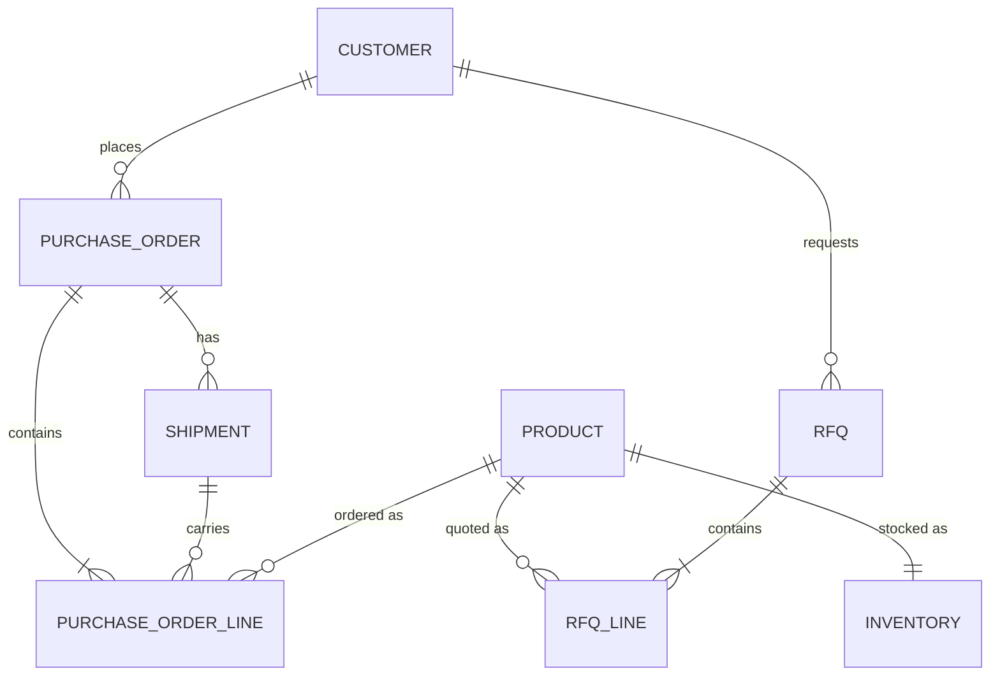

# Architecture

How the pieces fit, and why they are arranged this way.

---

## 1. The boundary

The single design decision everything else follows from:

> **The model decides what to ask for. The API decides what is true and what is
> allowed.**

The agent owns the conversation — understanding an ambiguous request, choosing a
tool, tracking two intents at once, phrasing an answer. It owns none of the
facts. It cannot know an order's status, and it cannot authorise a change.

Concretely, that means every business rule exists twice:

| Where | Form | Purpose |
|---|---|---|
| `agent/prompt.md` | Natural language | So the agent behaves well and explains itself |
| `backend/app/rules.py` | Pure functions | So the rule is *true* regardless |

The prompt is guidance. The code is enforcement. Tests assert the second, never
the first.

---

## 2. Request lifecycle

One tool call, end to end:

```
caller speaks
  → ElevenLabs ASR + LLM decide a tool is needed
  → HTTPS request to FastAPI
      X-Atlas-Api-Key       shared secret from the ElevenLabs secret store
      X-Conversation-Id     system__conversation_id dynamic variable
  → RequestLoggingMiddleware   assigns a request id, starts a timer
  → require_api_key            constant-time secret comparison
  → FastAPI/Pydantic           validates path, query and body
  → service layer              business logic
  → rules.py                   permitted?  ── no ──> audit(rejected) → typed error
  → SQLAlchemy                 read or write
  → audit_events               row written for anything that changed
  → response serialisation     derived fields, eligibility flags
  → middleware                 structured JSON log + activity-buffer entry
  → agent turns JSON into a sentence
```

Both exits — success and refusal — write an audit row and a log line. That is
what makes a conversation reconstructable afterwards.

---

## 3. Data model



Three modelling choices worth explaining:

**Order status and line status are separate enums.** A partially shipped order
sits in `processing` while one of its lines is already `shipped`. Collapsing
them into one field would make the most interesting business rule impossible to
express — and PO 1905 in the seed exists specifically to exercise it.

**Inventory tracks `quantity_on_hand` and `quantity_allocated` separately.** What
may be promised is the difference. Quoting on-hand alone overpromises stock that
is already committed to someone else's order.

**`AuditEvent.outcome` is `success` *or* `rejected`.** Recording only successes
would mean the moment a guardrail fired left no trace.

---

## 4. Designing responses for a listener

Tool responses are consumed by a language model that will read them aloud, which
changes what a good response looks like.

**Send derived fields.** The caller asks "is it shipping Friday?", so the
response carries `estimated_ship_day: "Friday"` next to the ISO date. Asking a
model to do date arithmetic is a reliable way to get a confident wrong answer.

**Send decisions, not just data.** Every order line carries `modifiable` and a
plain-English `modification_note` computed from `rules.py`. The agent knows what
it can offer *before* it offers it, which is what stops it promising a change the
API then refuses.

**Send less.** Tool results become context on every subsequent turn. Responses
carry what a representative would need, not everything the row contains.

**Make ambiguity explicit.** `search_products` returns `resolved: true/false`
plus `distinguishing_attributes` — the attributes on which candidates actually
differ — and a ready-made `clarification_hint`. Computing that server-side makes
it deterministic and testable rather than hoping the model spots the collision.

---

## 5. Error contract

One envelope for every failure, including reshaped FastAPI validation errors so
the agent never has to handle two formats:

```json
{"error": {"code": "...", "message": "...", "details": {}}}
```

| Code | HTTP | Meaning |
|---|---|---|
| `ORDER_NOT_FOUND` | 404 | No such PO |
| `LINE_NOT_FOUND` | 404 | No such line on that PO |
| `PRODUCT_NOT_FOUND` | 404 | Unknown SKU |
| `CUSTOMER_NOT_FOUND` | 404 | Unknown account |
| `ORDER_NOT_MODIFIABLE` | 409 | Order shipped or cancelled |
| `LINE_NOT_MODIFIABLE` | 409 | Line terminal, or changed underneath the agent |
| `QUANTITY_INCREASE_NOT_ALLOWED` | 409 | Allocated line; reductions only |
| `INSUFFICIENT_INVENTORY` | 409 | Increase exceeds uncommitted stock |
| `INVALID_QUANTITY` | 400 | Outside 1..100,000 |
| `VALIDATION_ERROR` | 422 | Malformed arguments |
| `UNAUTHORIZED` | 401 | Missing or wrong shared secret |
| `SERVICE_UNAVAILABLE` | 503 | Injected fault (demo only) |
| `INTERNAL_ERROR` | 500 | Unhandled; leaks nothing |

`message` is written to be spoken almost verbatim. `details` carries structure
the agent can use to ask a better question. Every tool sets
`tool_error_handling_mode: "passthrough"` — the platform default hides tool
errors from the agent, which would leave it unable to say *why* something failed.

---

## 6. Session state

Three mechanisms, each for what it is good at:

| State | Where | Why |
|---|---|---|
| Active PO, customer account, RFQ number | ElevenLabs **dynamic variables**, assigned from tool responses | The platform threads them across turns; the caller never repeats their PO number |
| What is on the order right now | **The database**, re-read per call | Conversation memory drifts; rows do not |
| Tool calls and their arguments | **Backend ring buffer**, keyed by conversation id | Powers the Developer View |

Each webhook tool declares `assignments` — for example `lookup_order` extracts
`po_number` into `active_po_number`. That is configuration, not prompt text, so
it cannot be forgotten mid-conversation.

---

## 7. Concurrency and idempotency

Two places where a voice agent needs more care than a form does, because a call
takes time and tool calls can be retried:

**Optimistic concurrency.** `update_order_line` accepts an optional
`expected_current_quantity`. The agent read the order, held a conversation, and
by the time the caller says yes the line may have moved. Supplying the value it
saw makes the API refuse rather than blindly overwrite someone else's change.

**Idempotency.** `create_rfq` accepts an `idempotency_key`. A tool call that
times out and retries would otherwise book the same quote twice; with a key, the
second call returns the original RFQ and reports `idempotent_replay: true`.

---

## 8. Observability

| Layer | What it gives you |
|---|---|
| Structured JSON logs | Every request with method, path, status, duration, request id, conversation id |
| `audit_events` | Durable record of every attempted state change, successful or refused |
| Activity ring buffer | Recent tool calls **with their arguments**, keyed by conversation |
| Developer View | Tool timeline, session context, and state changes, live during a call |

The buffer exists because of a gap: the ElevenLabs client SDK reports which tool
ran (`onAgentToolRequest`) and what came back (`onAgentToolResponse`), but not
the arguments the agent chose. Those exist only server-side, so the UI merges the
two feeds by tool name in call order, joined on the conversation id the tools
forward.

> **Implementation note.** Filling that buffer surfaced a real Starlette
> behaviour: `BaseHTTPMiddleware` runs the downstream app in a separate task, so
> a `ContextVar` set inside a route handler is invisible to the middleware
> afterwards. The middleware now seeds a *mutable dict* that the route fills in;
> the object is shared even though the context copy is not.

---

## 9. Security boundaries

| Boundary | Control |
|---|---|
| ElevenLabs → backend | Shared secret in `X-Atlas-Api-Key`, constant-time compare; stored in the ElevenLabs secret store and referenced by id, never committed |
| Browser → ElevenLabs | Per-call conversation token minted by a Next.js route; the API key stays server-side |
| Browser → backend | Only through `/api/atlas/[...path]`, allow-listed to the demo/observability endpoints. The UI **cannot** reach the business API, so it cannot modify an order |
| Demo endpoints | Gated behind `ATLAS_DEMO_MODE`; 403 when off |

The only path to a write is the agent's own authenticated tool call, which then
has to satisfy `rules.py`.

This is demo-grade, and [the README says so plainly](../README.md#what-this-is-not).
A production version needs per-caller identity, request signing, and
authorisation scoped so one customer cannot read another's orders.
